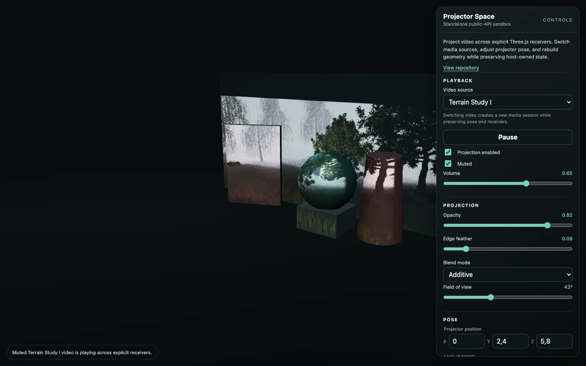
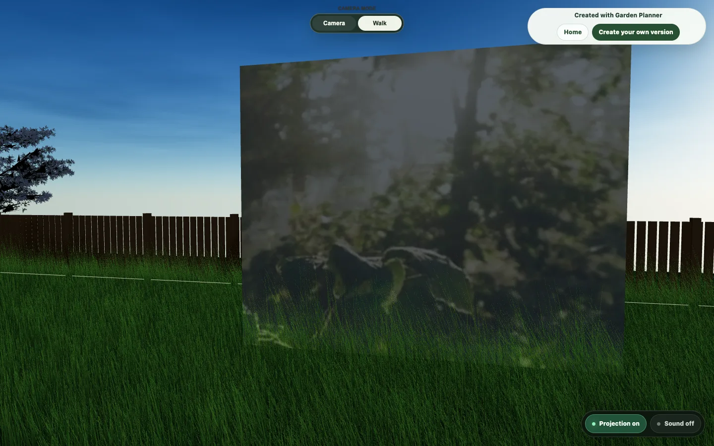

# Projector Space

`three-projective-media`

Projective media for Three.js, validated under real application constraints.

> **Pre-release v0.1.0**

## Overview

`three-projective-media` projects one HTML video texture onto host-selected
Three.js meshes in projector space. The package owns the projector camera,
shader material, receiver overlays, video element, and `VideoTexture` while
leaving scene policy, authored state, asset resolution, and UI to the host.

Projector pose and receiver selection are independent. A host supplies a
world-space position and look-at point, then explicitly registers receiver
roots or meshes. The package never scans a global scene.



## Status

This repository is preparing the `0.1.0` pre-release. The source-ESM API,
package-owned tests, and standalone sandbox are available for review. The live
sandbox is deployed through GitHub Pages.

The package is not yet published to npm or described as stable, and there is
no production-support commitment yet. Distribution remains pre-release, and
consumers should pin an exact reviewed commit.

Public demonstrations:

- [Standalone sandbox](https://bartoszubak.github.io/three-projective-media/) —
  a small host demonstrating the public API, media controls, projector pose,
  and dynamic receiver lifecycle.
- [Nocturne Garden](https://playzafiro.com/garden-planner/p/nocturne-garden) —
  a published Garden Planner scene demonstrating the package in its
  application-scale reference integration.

## Why not start with a sandbox?

A shader-only sandbox can demonstrate projected UV mapping, but it does not
exercise the ownership and lifecycle failures that define a reusable runtime.
The first integration was therefore developed inside a mature Three.js editor,
where receivers are created and replaced dynamically, media playback can be
blocked, authored state is persisted, and editor interactions compete for
camera and pointer input.

The later standalone sandbox demonstrates portability. It was deliberately not
used as the primary environment for discovering the library boundary.

## Garden Planner as a validation host

The first integration was intentionally developed inside Garden Planner rather
than in an isolated demo. The purpose was not to make the library
Garden Planner-specific. Garden Planner provided an environment complex enough
to expose failure modes a synthetic sandbox would likely hide, including:

- dynamic receiver creation, rebuilding, and removal;
- ownership of video elements, textures, materials, and overlays;
- transactional construction failure;
- idempotent, best-effort teardown;
- camera and authoring interaction conflicts;
- persistence and public read-only sessions;
- autoplay and audio state;
- media-session replacement without corrupting authored projector state.

Garden Planner was used as a validation host, not as the architectural boundary
of the library. It remains the reference integration, while this extracted
runtime contains no Garden Planner domain, UI, persistence, asset catalog, or
asset-resolution logic.

## Live reference integration

[Nocturne Garden](https://playzafiro.com/garden-planner/p/nocturne-garden)
is a published Garden Planner scene demonstrating `three-projective-media`
inside the application that originally served as its validation host.

[](https://playzafiro.com/garden-planner/p/nocturne-garden)

*Nocturne Garden places the projective-media runtime inside Garden Planner's
persisted, published, read-only scene workflow.*

The scene exercises the reusable runtime through a full product workflow:
authored world-space projector pose, product-owned media selection and asset
resolution, dynamic receiver lifecycle, project persistence, publishing, and
read-only public playback with host-managed projection and sound controls.

The [standalone sandbox](https://bartoszubak.github.io/three-projective-media/)
is the portability and public-API demonstration. Nocturne Garden is the
application-scale reference integration. Garden Planner continues to own domain
state, persistence, UI, media catalogs, asset resolution, and receiver policy;
the package continues to own projective-media rendering, browser media
resources, receiver overlays, and lifecycle cleanup.

## Development chronology

| Date | Validation checkpoint | Public result |
|---|---|---|
| July 18 | first application integration | source and material ownership |
| July 19 | dynamic receivers and persistence | receiver-root lifecycle |
| July 20 | free world-space authoring | pose independent from receivers |
| July 21 | extraction hardening | standalone tests and safe disposal |

The full environment → failure → consequence → evidence progression is recorded
in the [validation timeline](docs/VALIDATION_TIMELINE.md).

## Why the Git history starts here

The public Git history is path-scoped. History-preserving extraction retained
only commits that touched the neutral package prefix; the private validation
host and its product-owned source were intentionally not published. The short
log therefore describes the emergence of this reusable boundary, not every
iteration that led to it.

The application-scale chronology and technical outcomes are documented through
public tests, the validation timeline, and the standalone sandbox. The earlier
private history was not reconstructed, redated, or replaced with artificial
presentation commits. See the
[extraction provenance](docs/EXTRACTION_PROVENANCE.md) for the exact method.

## Key engineering decisions

| Decision | Reason |
|---|---|
| explicit receiver registration | no global scene scanning |
| pose independent from receivers | projector is not anchored to host objects |
| host-owned media replacement | unrelated media need distinct sessions |
| transactional construction | partial resources must not leak |
| best-effort disposal | one callback must not block teardown |
| host-owned UI and persistence | neutral runtime stays reusable |
| application-scale validation first | expose failure modes before abstraction |

Development responsibilities and review evidence are summarized in the
[OpenAI Build Week development notes](docs/BUILD_WEEK.md).

## Installation — pre-release

The package is not available from the npm registry yet. It can be installed
directly from GitHub by replacing `<commit-sha>` with an exact reviewed commit:

```bash
npm install github:bartoszubak/three-projective-media#<commit-sha>
```

Do not use the placeholder literally. Pinning an exact SHA is intentional while
the API remains pre-release.

## Minimal quick start

```js
import * as THREE from "three";
import { createProjectiveMediaProjector } from "three-projective-media";

const receiverRoot = new THREE.Group();
scene.add(receiverRoot);

const projector = createProjectiveMediaProjector({
  mediaUrl: "/media/projection.mp4",
  receiverRoots: [receiverRoot],
  projector: {
    position: new THREE.Vector3(0, 2, -5),
    target: new THREE.Vector3(0, 1, 0),
    up: new THREE.Vector3(0, 1, 0),
    fovDeg: 45,
    aspectRatio: 16 / 9,
    near: 0.1,
    far: 20,
  },
  appearance: {
    enabled: true,
    opacity: 0.8,
    edgeFeather: 0.08,
    blendMode: "additive",
  },
  media: {
    muted: true,
    loop: true,
    volume: 0.8,
  },
});

function render() {
  projector.update();
  renderer.render(scene, camera);
  requestAnimationFrame(render);
}

render();

// Call this when the host tears down the projection session.
function stopProjection() {
  projector.dispose();
}
```

The host is responsible for placing physical meshes under `receiverRoot`,
refreshing bindings after structural changes, and disposing the projector when
the session ends.

## Public API

The package root exports:

- `createProjectiveMediaSource()` for one owned `HTMLVideoElement` and
  `VideoTexture`;
- `createProjectiveMediaMaterial()` and material update helpers;
- `createProjectiveMediaProjector()` for camera pose, receiver bindings,
  playback, status, frame updates, and disposal;
- blend-mode, shader, and camera-default constants;
- projector-space math, normalization, camera-pose, and matrix helpers.

The complete export surface is defined by [`src/index.js`](src/index.js). Hosts
should import from `three-projective-media`, not internal source modules.

## Receiver roots and explicit receivers

Receivers are always opt-in:

- `setReceiverRoots(roots, { receiverFilter })` traverses only supplied
  `Object3D` roots;
- `addReceiverRoot`, `removeReceiverRoot`, and `clearReceiverRoots` mutate root
  configuration;
- `setReceivers`, `addReceiver`, `removeReceiver`, and `clearReceivers` manage
  explicit meshes;
- `refreshReceivers()` diffs current descendants;
- `detachReceiverObject(object)` detaches one subtree without removing root
  configuration;
- `getReceiverRoots`, `getReceiverMeshes`, and `getOverlayMeshes` return
  collection copies.

Overlapping roots and explicit receivers are deduplicated by source mesh
identity. The optional filter receives `{ object, root, material }`; an
exception rejects only that candidate. The package does not observe mutations,
scan a scene globally, or traverse receiver roots during `update()`.

Supported receivers are ordinary `Mesh` objects with `BufferGeometry` and a
position attribute. `SkinnedMesh`, `InstancedMesh`, invalid geometry, and the
package's own overlay meshes are skipped.

## Media and resource ownership

By default, `createProjectiveMediaProjector()` owns the media source it creates.
It also owns its projector camera, shader material, and receiver overlay
objects. Source geometry, source materials, receiver roots, and host meshes
remain host-owned and are never disposed by the package.

Hosts may provide a media source and set `disposeMediaSource: false` to retain
ownership. The projector will still unsubscribe its status listener and release
its own material, camera attachment, and overlays.

## Lifecycle and refresh

Construction is transactional. Partial video, texture, camera, shader, and
overlay resources are released on failure while preserving the original error.

Call `refreshReceivers()` only after host-owned object lifecycle changes.
Refresh diffs bindings while preserving the media element, `VideoTexture`,
audio state, playback position, camera pose, FOV, and valid overlays. Call
`update()` once per render frame for matrix updates and broad-phase projector
frustum culling; it iterates bindings rather than traversing roots.

`dispose()` is idempotent and best-effort. One failing host unsubscribe,
overlay detach, material cleanup, or owned media-source disposal does not block
remaining cleanup or the final disposed state. Subscriber failures are isolated
from state changes and teardown.

## Autoplay and audio

Muted autoplay is the portable default. Playback rejection becomes a
controlled status result rather than an unhandled exception. Audio stays
embedded in the source video and can be managed through projector controls
without replacing the media session.

Different media URLs should be represented by different media sessions at the
host level. The package does not attempt to transfer playback time between
unrelated videos.

## Current limitations

The package currently provides no projector depth map, scene occlusion,
keystone correction, `SkinnedMesh` or `InstancedMesh` receivers, alpha-card
mask inheritance, volumetric beam, post-processing, visible frustum helper,
multi-projector edge blending, media catalog, upload UI, authoring gizmos, or
global scene discovery.

Broad-phase frustum culling reduces overlay draw calls; fragment-level
projector bounds remain the exact mapping test. Missing geometry bounding
spheres use a safe visible fallback and are not computed or mutated.

## Validation and tests

Package-owned tests live in `tests/` and import only the public source entry.
Use Node 24.18.0:

```bash
npm ci
npm test
npm run verify
```

`npm run verify` runs the full test suite, verifies and builds the standalone
demo, and performs a dry-run package inspection. The reference integration
continues to validate dynamic receivers, media replacement, persistence,
public read-only playback, and editor lifecycle at application scale. See the
[validation strategy](https://github.com/bartoszubak/three-projective-media/blob/main/docs/VALIDATION_STRATEGY.md)
and
[extraction provenance](https://github.com/bartoszubak/three-projective-media/blob/main/docs/EXTRACTION_PROVENANCE.md).

## Standalone sandbox

The laboratory sandbox is a second, deliberately small host. It imports only
the `three-projective-media` package root and demonstrates projector pose,
explicit receivers, media controls, frustum diagnostics, and a dynamic receiver
rebuild. It is portability evidence and executable API documentation; it does
not replace the application-scale validation that exposed the lifecycle and
ownership requirements.

Run it locally with Node 24.18.0:

```bash
npm ci
npm run dev
```

Create and preview the production build:

```bash
npm run build:demo
npm run preview:demo
```

The demo offers four local sources: three author-recorded Terrain Studies
captured from [Zafiro Isle Lab](https://playzafiro.com/isle-lab/) and one
procedural Abstract Color Field. Only one media session is active at a time,
and inactive videos are not preloaded. The dropdown demonstrates host-owned
media-session replacement while preserving projector pose and receiver
registration. The sandbox-owned catalog remains outside the package source,
and demo media is excluded from the package tarball.

## Live sandbox

<https://bartoszubak.github.io/three-projective-media/>

The sandbox is built and deployed automatically from `main` through GitHub
Actions.

## Supported and validated platforms

Validated during this checkpoint:

- current Chrome on macOS;
- Node 24.18.0;
- npm 11.16.0;
- Three.js 0.185.x.

Runtime requirements are a modern browser, a native-ESM-aware build system,
`HTMLVideoElement`, and a WebGL-capable Three.js runtime. Safari and Firefox are
not yet claimed as validated.

## Build Week development process

Codex supported repository audits, implementation, tests, browser smoke,
extraction, and CI and GitHub Pages automation. GPT-5.6 supported architecture
analysis, failure-mode review, acceptance-criteria design, and review of the
reusable boundary. The human author retained product decisions, UX direction,
architectural judgment, and manual acceptance.

The detailed division of work and submission checklist are in
[docs/BUILD_WEEK.md](docs/BUILD_WEEK.md); no runtime dependency on either tool
is introduced.

## License

The software is MIT-licensed; see [LICENSE](LICENSE). The Terrain Study videos
are original demonstration recordings captured from
[Zafiro Isle Lab](https://playzafiro.com/isle-lab/) and created by Bartek Bąk.
Media provenance and encoding details are documented in
[examples/basic/public/media/README.md](examples/basic/public/media/README.md).
